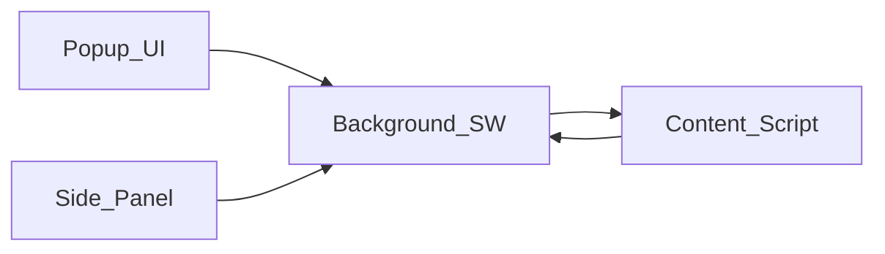

# Job Application Autofill Assistant

Personal-use Chrome extension (Manifest V3) that scans job application pages, infers field meanings from labels and related text, and fills only high-confidence matches. **It never submits forms, never clicks submit, and never navigates automatically.**

## Requirements

- Node.js 20+
- Google Chrome (recent version with side panel support)

## Setup

```bash
npm install
npm run icons
npm run build
```

Development build with HMR:

```bash
npm run dev
```

## Load the unpacked extension

1. Open `chrome://extensions`
2. Enable **Developer mode**
3. Click **Load unpacked**
4. Choose the `dist` folder from this project (created after `npm run build` or during `npm run dev`)

## Usage

1. Open your profile in the **extension popup** (toolbar icon). Enter data and adjust the confidence threshold, overwrite, highlight, and debug options. Click **Save**.
2. On an application page, click **Scan current tab** in the popup (or **Rescan** in the side panel).
3. Open the **side panel** from the popup to review detected fields, confidence, planned values, and classification reasons.
4. Use **Dry run** to preview actions without changing the page, then **Fill** when ready. Review everything and **submit manually** on the site.

## Architecture

| Part | Role |
|------|------|
| `src/background` | Service worker: typed message router, coordinates tab ↔ content, persists last scan in `chrome.storage.session` |
| `src/content` | DOM scan, classification pipeline, safe fill + highlights |
| `src/popup` | React control center: profile editor, settings, scan + open side panel |
| `src/sidepanel` | React review UI: filters, dry run / fill / rescan / clear highlights |
| `src/fieldDetection` | Visibility, labels, ARIA, context, radios/selects → `FieldDescriptor` |
| `src/classification` | Synonym dictionary + scoring → canonical `ProfileKey` + confidence |
| `src/fill` | Value set + `input`/`change` events, conservative checkbox/radio rules, no file auto-fill |
| `src/storage` | Zod schemas + `chrome.storage.local` for profile/settings |
| `src/shared` | Types, fingerprints, message contracts |
| `src/debug` | Structured logger gated by verbose setting |



## Safety constraints (MVP)

- No `form.submit()`, no programmatic submit clicks, no auto-navigation
- File inputs are detected and marked **manual** only
- Password fields are ignored by the detector
- Checkbox filling is limited (e.g. sponsorship) — consent/policy heuristics are penalized

## Tests

```bash
npm test
```

Unit tests cover the pure classification layer with common ATS-style labels.

## Limitations

- Shadow DOM / cross-origin iframes are not supported
- Some React-controlled sites may still need synonym tuning; extend `src/classification/synonyms.ts` and add tests
